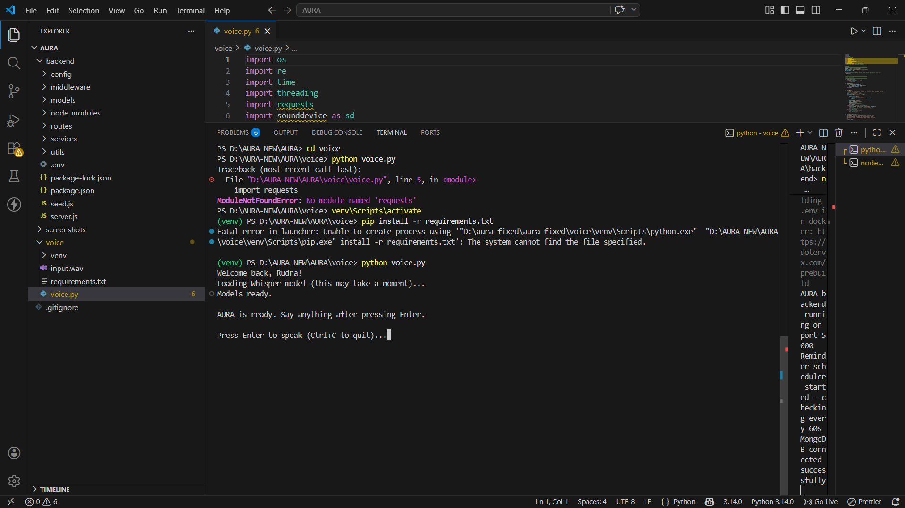
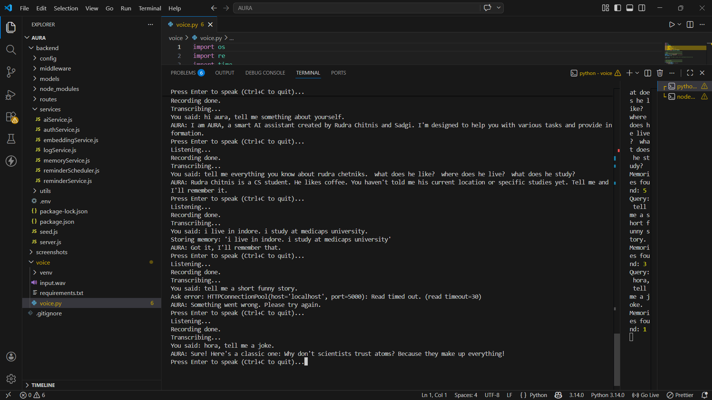
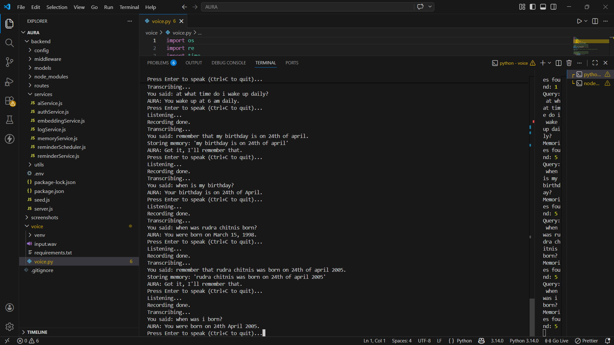
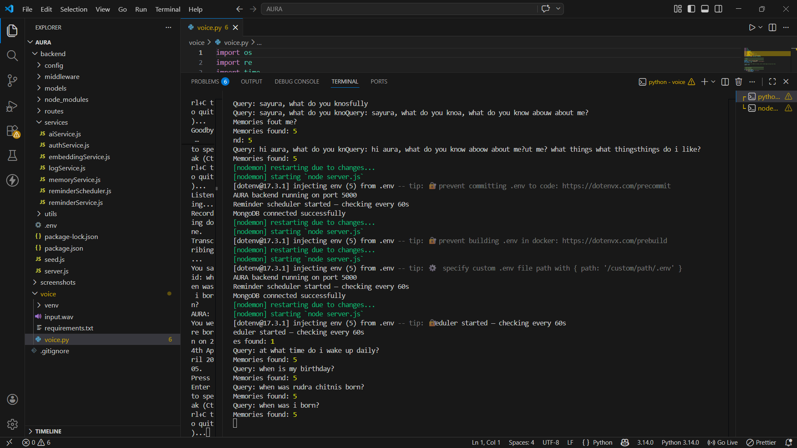

<div align="center">

# 🔮 AURA
### Adaptive User Response Assistant

*A voice-driven ambient AI assistant that listens, remembers, and talks back — running fully on your machine.*

<br/>


<br/>

> 🚫 No cloud APIs. &nbsp;🔒 No subscriptions. &nbsp;💻 Everything runs locally on your machine.

</div>

---

## 📸 Screenshots

> **Startup & Login**



> **Voice interaction — asking questions, storing memories**



> **Memory being stored and retrieved correctly**



> **Backend running with reminder scheduler**



---

## 🧠 What is AURA?

AURA is a **personal AI voice assistant** you talk to through your microphone. It understands you, remembers things about you, answers general knowledge questions, sets reminders, and speaks back — like a local, privacy-first Jarvis.

Instead of a chat interface, AURA is designed to be a **background assistant** — you press Enter, speak, and it responds out loud.

---

## ✨ What AURA Can Do

| 🎤 You say | 🔮 AURA does |
|---|---|
| *"Who am I?"* | Pulls your identity from memory and introduces you |
| *"Where do I live?"* | *"You live in Indore."* |
| *"Remember that I have an exam on Friday"* | Stores it as a schedule memory with embeddings |
| *"What kind of music do I like?"* | Retrieves your music preference from memory |
| *"Who is the best Indian female singer?"* | Answers from Mistral's general knowledge |
| *"Remind me to study at 7pm"* | Sets a reminder, speaks it aloud at 7pm automatically |
| *"Who created you?"* | *"You did, Rudra."* |
| *"Tell me everything you know about me"* | Lists only facts actually stored in your memory |

---

## 🏗️ Project Structure
```
aura/
├── 📁 backend/
│   ├── 📁 config/
│   │   └── mongo.js               # MongoDB connection
│   ├── 📁 middleware/
│   │   ├── authMiddleware.js       # JWT verification
│   │   └── errorHandler.js        # Global error handler
│   ├── 📁 models/
│   │   ├── userModel.js            # User schema
│   │   ├── memoryModel.js          # Memory + vector embeddings
│   │   ├── reminderModel.js        # Reminder schema
│   │   └── logModel.js             # Activity logs
│   ├── 📁 routes/
│   │   ├── authRoute.js            # Register / Login / Profile
│   │   ├── aiRoute.js              # POST /api/ai/ask
│   │   ├── memoryRoute.js          # Store / List / Search
│   │   ├── reminderRoute.js        # Create / List / Cancel
│   │   └── logRoute.js             # Logs
│   ├── 📁 services/
│   │   ├── aiService.js            # Prompt builder + Ollama call
│   │   ├── authService.js          # Auth logic
│   │   ├── memoryService.js        # Embeddings + cosine search
│   │   ├── embeddingService.js     # MiniLM-L6-v2 local model
│   │   ├── reminderService.js      # Reminder CRUD
│   │   ├── reminderScheduler.js    # 60s background scheduler
│   │   └── logService.js           # Log creation
│   ├── 📁 utils/
│   │   ├── similarity.js           # Cosine similarity
│   │   └── token.js                # JWT generation
│   ├── .env.example
│   ├── package.json
│   └── server.js                   # Entry point
│
└── 📁 voice/
    ├── voice.py                    # Main voice loop
    └── requirements.txt
```

---

## ⚙️ How It Works

### 🎙️ Full Voice Pipeline
```
🎤 You press Enter and speak
        ↓
🔴 Microphone records audio (7 seconds)
        ↓
🧠 faster-whisper transcribes speech → text
        ↓
🔍 Intent detection
        ↓
   ┌────────────────────────────────────────┐
   │  set_reminder  →  POST /api/reminders  │
   │  store_memory  →  POST /api/memory     │
   │  ask           →  POST /api/ai/ask     │
   └────────────────────────────────────────┘
        ↓
📦 Query embedding generated (MiniLM-L6-v2)
        ↓
🔎 Cosine similarity search across your memories
        ↓
💬 Relevant memories injected into Mistral prompt
        ↓
🤖 Mistral generates a response via Ollama
        ↓
🔊 pyttsx3 speaks the answer aloud
```

---

### 🧩 Memory System (RAG-lite)

AURA uses a lightweight **Retrieval Augmented Generation** memory system — no external vector database needed.

- When you tell AURA something, it generates a **384-dimension vector embedding** using `all-MiniLM-L6-v2` running locally
- Embeddings are stored in **MongoDB** alongside the raw text
- On every query, AURA embeds your question and runs **cosine similarity** against all stored memories
- Only semantically relevant memories (similarity score > 0.2) are passed to Mistral as context
- Mistral uses **only those facts** to answer personal questions — no hallucination

**Memory types:**

| Type | Examples |
|---|---|
| 🙍 `personal` | name, age, hometown, family |
| 📅 `schedule` | classes, gym, meetings, deadlines |
| ❤️ `preference` | favourite music, food, apps, tools |
| 🎯 `identity` | your projects, goals, who you are |

---

### 🤖 AI Decision Logic

AURA's prompt makes Mistral follow a 3-step decision process on every query:
```
Is this a personal question about the user?
    YES → Use memory block only. Never invent facts.
    NO  ↓
Is this a general knowledge question?
    YES → Answer freely from Mistral's training knowledge.
    NO  ↓
Is it a mix of both?
    → Check memory first, fall back to general knowledge.
```

---

### ⏰ Reminder System
```
You say "Remind me to study at 7pm"
        ↓
Natural language time parser extracts time → 19:00
        ↓
Reminder stored in MongoDB with ISO timestamp
        ↓
Background scheduler checks every 60 seconds
        ↓
At 7:00 PM → reminder fires into queue
        ↓
Voice client polls /api/reminders/pending-voice every 30s
        ↓
🔊 AURA speaks "Study session" aloud automatically
```

---

## 🛠️ Tech Stack

| Layer | Technology |
|---|---|
| 🎤 Voice capture | `sounddevice` + `scipy` |
| 🗣️ Speech to text | `faster-whisper` — medium model, CPU int8 |
| 🔊 Text to speech | `pyttsx3` — Windows SAPI5 |
| 🔍 Intent detection | Keyword-based routing |
| 🖥️ Backend server | Node.js + Express 5 |
| 🔐 Authentication | JWT + bcryptjs |
| 🗄️ Database | MongoDB + Mongoose |
| 🧮 Embeddings | `@xenova/transformers` — `all-MiniLM-L6-v2` |
| 📐 Vector search | Custom cosine similarity |
| 🤖 LLM | Mistral 7B via Ollama — fully local |

---

## 🚀 Setup & Installation

### Prerequisites

- Node.js 18+
- Python 3.10+
- MongoDB running locally
- [Ollama](https://ollama.ai) installed

---

### 1️⃣ Clone the repo
```bash
git clone https://github.com/YOUR_USERNAME/AURA.git
cd AURA
```

### 2️⃣ Backend setup
```bash
cd backend
npm install
cp .env.example .env
```

Fill in your `.env`:
```env
PORT=5000
MONGO_URI=mongodb://localhost:27017/aura
JWT_SECRET=your_random_secret_here
OLLAMA_HOST=http://localhost:11434
OLLAMA_MODEL=mistral
```

Generate a secure JWT secret:
```bash
node -e "console.log(require('crypto').randomBytes(32).toString('hex'))"
```

### 3️⃣ Pull the LLM
```bash
ollama pull mistral
```

> 💡 On low-RAM machines use `ollama pull tinyllama` and set `OLLAMA_MODEL=tinyllama` in `.env`

### 4️⃣ Start Ollama + backend
```bash
# Terminal 1
ollama serve

# Terminal 2
cd backend
npm run dev
```

### 5️⃣ Register your account
```bash
curl -X POST http://localhost:5000/api/auth/register \
  -H "Content-Type: application/json" \
  -d "{\"name\": \"Your Name\", \"email\": \"you@email.com\", \"password\": \"yourpassword\"}"
```

### 6️⃣ Voice client
```bash
cd voice
pip install -r requirements.txt
python voice.py
```

First run asks for email + password once. Token saved automatically to `~/.aura_token`.

---

## 🎤 Usage

Press **Enter** to speak. AURA listens for 7 seconds then responds.
```
🟢 Asking questions
   "Who am I?"
   "What do I have scheduled this week?"
   "Who is Elon Musk?"
   "What time is it?"

🟣 Storing memories
   "Remember that I have a meeting on Monday at 10am"
   "My favourite food is pizza"
   "Remember that I prefer dark mode"

🔴 Setting reminders
   "Remind me to study at 7pm"
   "Remind me to call mom in 30 minutes"
   "Remind me to drink water at 9am"
```

---

## 📡 API Reference

<details>
<summary><b>Auth Routes</b></summary>
```
POST /api/auth/register    { name, email, password }
POST /api/auth/login       { email, password } → { token }
GET  /api/auth/profile     → { user }
```
</details>

<details>
<summary><b>AI Routes</b></summary>
```
POST /api/ai/ask           { query, time_context? } → { answer, memories }
```
</details>

<details>
<summary><b>Memory Routes</b></summary>
```
POST /api/memory/store     { content, type }
GET  /api/memory/list      → { memories }
POST /api/memory/search    { query } → { results }
```
</details>

<details>
<summary><b>Reminder Routes</b></summary>
```
POST   /api/reminders           { text, reminderTime }
GET    /api/reminders           → { reminders }
DELETE /api/reminders/:id
GET    /api/reminders/pending-voice  → { fired }
```
</details>

---

## 🗺️ Roadmap

- [x] Voice capture + Whisper transcription
- [x] RAG-lite memory with vector embeddings
- [x] JWT authentication with auto token management
- [x] Reminder system with background scheduler
- [x] Intent detection (reminders / memory / general questions)
- [x] Hallucination prevention with strict prompt rules
- [x] Time-aware responses
- [ ] 🔜 Wake word detection — "Hey AURA" always listening
- [ ] 🔜 Electron desktop app with floating orb UI
- [ ] 🔜 Voice activity detection — stop on silence
- [ ] 🔜 React Native mobile companion app
- [ ] 🔜 Full vector database (FAISS / Chroma)
- [ ] 🔜 Multi-device sync
- [ ] 🔜 Offline mode

---

## ⚠️ Known Limitations

- Recording is fixed at 7 seconds — silence detection not yet implemented
- Whisper medium model can be slow on first run (model loading)
- Mistral needs ~8GB RAM — use TinyLlama on lower-end machines
- Tested on Windows only (pyttsx3 SAPI5)

---

## 👤 Author

<div align="center">

**Rudra Chitnis**

Built AURA as a project exploring voice AI, local LLMs, and vector memory systems.

[](https://github.com/Rudra-Chitnis)

</div>

---

<div align="center">

⭐ **If you found this interesting, give it a star!** ⭐

*Made with 🔮 by Rudra Chitnis*

</div>